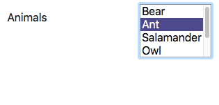
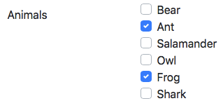

# select-to-checkbox

Convert select element to checkboxes or radio buttons jQuery plugin.

<a href="https://jsfiddle.net/andreww1011/18jszxnv/">JSFiddle</a>

Easily change the look and feel of HTML <code>&ltselect&gt</code> elements:
<ul>
  <li>options of a single <code>&ltselect&gt</code> displayed as radio buttons.</li>
  <li>options of a multiple <code>&ltselect&gt</code> displayed as checkboxes.</li>
  <li>ability to programmatically select, deselect, enable and disable options.</li>
</ul>

Uses Bootstrap classes for styling.  Easily modify CSS to match your theme.

  <table>
    <tr>
      <td>
        
      </td>
      <td>
        
      </td>
    </tr>
  </table>

# Usage

  <ol>
    <li>Load jQuery, Bootstrap, and the plugin bundle in your HTML code.
    <pre><code>&ltscript src="https://code.jquery.com/jquery-3.2.1.slim.min.js"&gt&lt/script&gt
&ltlink rel="stylesheet" href="https://maxcdn.bootstrapcdn.com/bootstrap/4.0.0/css/bootstrap.min.css"/&gt
...
&ltlink rel="stylesheet" href="select_to_checkbox.css"/&gt
&ltscript src="select-to-checkbox-bundle.min.js"&gt&lt/script&gt</code></pre></li>
    <li>Define a <code>&ltselect&gt</code> element with a <i>name</i> attribute in your HTML code.  Supported optional attributes: <i>multiple</i> - enables multiple option selection and will display checkboxes; <i>disabled</i> - disables the dropdown.</li>  
    <li>Define <code>&ltoption&gt</code>'s with unique <i>value</i> attributes.  Supported optional attributes: <i>label</i> - alternate display text; <i>selected</i> - pre-select this option; <i>disabled</i> - disable this option.
    <pre><code>&ltform&gt
  ...
  &ltselect multiple id="pets" name="pets"&gt
    &ltoption value="0"&gtDoge&lt/option&gt
    &ltoption value="1" selected&gtKeyboard Cat&lt/option&gt
    &ltoption value="2" label="Badger" disabled&gtBadger Badger Badger&lt/option&gt
    ...</code></pre></li>
    <li>Use jQuery to target the <code>&ltselect&gt</code> and apply the plugin.  The HTML is replaced by the plugin in the DOM.
    <pre><code>&ltscript&gt
  $(function () {
    $('#pets').selectToCheckbox();
  });
&lt/script&gt</code></pre></li>
  </ol>
  

    
  

# Options

The following indexed parameters can be passed to <code>selectToCheckbox()</code> at construction.
  <ul>
    <li><code>allowEnablingAndDisabling</code> - whether programmatically toggling disabled is permitted.  <i>default=true</i></li>
    <li><code>items</code> - array of additional items to append to options in group.  Each array entry should have the form:  
      <pre><code>[label:string, value:string, selected?=false, disabled?=false]</code></pre></li>
  </ul>

# Methods

The following methods are exposed on the plugin:
  <ul>
    <li><code>hasOption(value:string)</code> - returns true if the option with the specified <i>value</i> attribute exists, otherwise false.</li>
    <li><code>selectOption(value:string)</code> - selects the option with the specified <i>value</i> attribute, otherwise does nothing if it does not exist or if it is disabled.</li>
    <li><code>deselectOption(value:string)</code> - deselects the option with the specified <i>value</i> attribute, otherwise does nothing if it does not exist or if it is disabled.</li>
    <li><code>isOptionSelected(value:string)</code> - returns true if the option with the specified <i>value</i> attribute exists and is selected, otherwise false.</li>
    <li><code>enableOption(value:string)</code> - enables the option with the specified <i>value</i> attribute, otherwise does nothing if it does not exist or if enabling is not permitted.</li>
    <li><code>disableOption(value:string)</code> - disables the option with the specified <i>value</i> attribute, otherwise does nothing if it does not exist or if disabling is not permitted.</li>
    <li><code>isOptionDisabled(value:string)</code> - returns true if the option with the specified <i>value</i> attribute exists and is disabled, otherwise false.</li>
    <li><code>enable()</code> - enables this group, otherwise does nothing if enabling is not permitted.</li>
    <li><code>disable()</code> - disables this group, otherwise does nothing if disabling is not permitted.</li>
    <li><code>getSelectedOptionsAsJson(includeDisabled=true)</code> - returns a JSON string of the selected options' values.</li>
  </ul>

  
